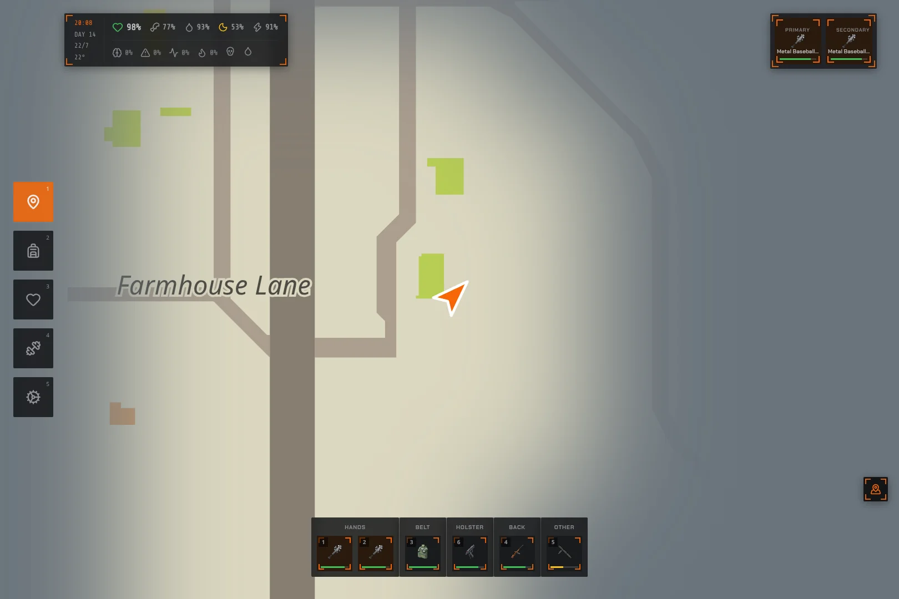
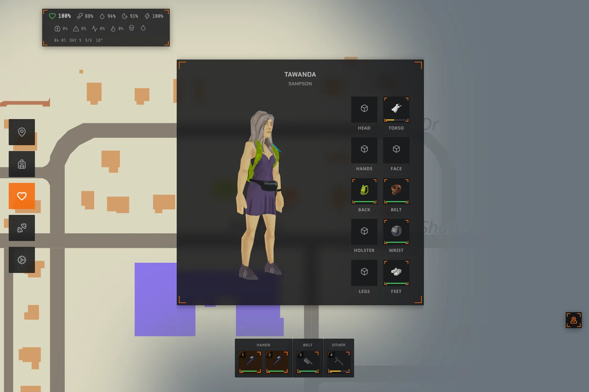
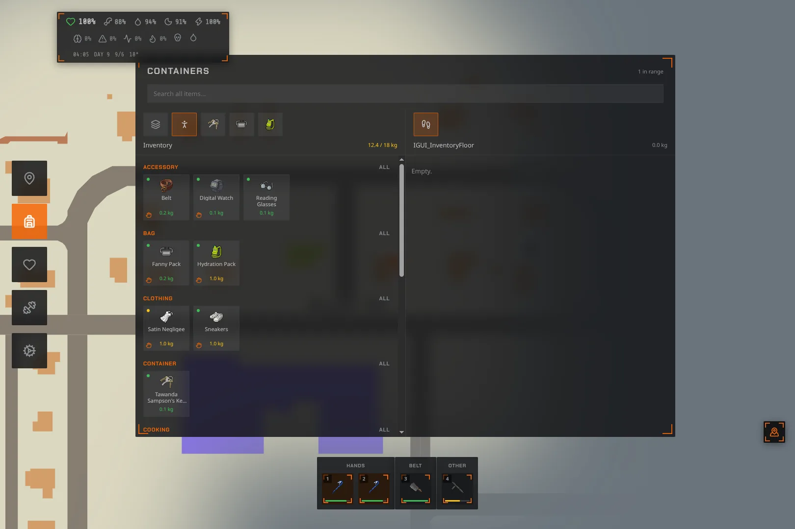
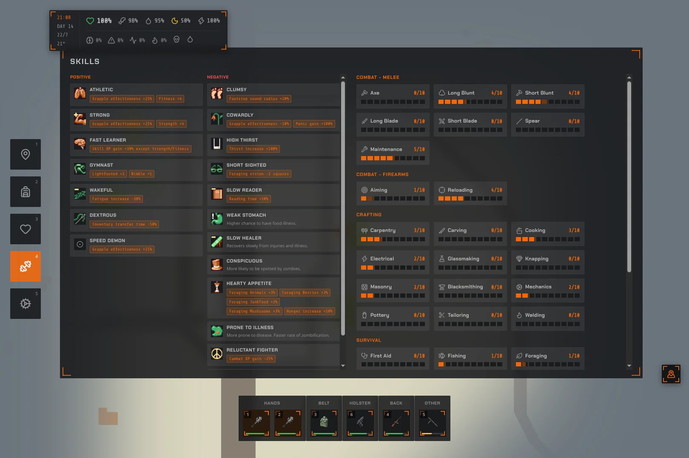
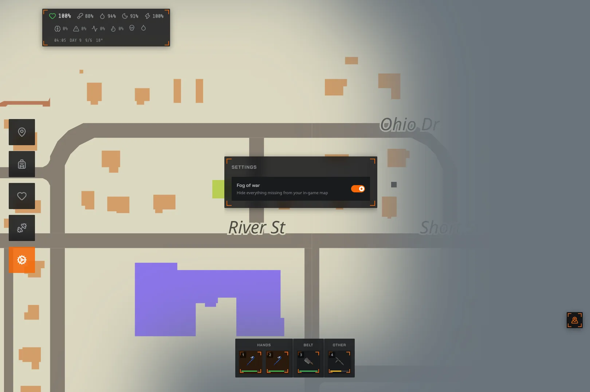
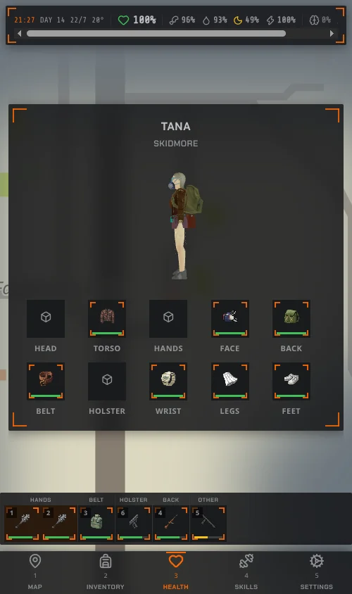

# PZ Dashboard

A second-screen companion for Project Zomboid. A client-side Lua mod streams
live game state out of the running game; a local Bun server picks it up and
serves a browser dashboard you can keep open on a phone, tablet or handheld
next to the game.

The PZ Lua sandbox has no network access, so the mod writes JSON snapshots
into `<Zomboid>/Lua/PZDashboard_<category>.json` and the server watches that
folder. The same folder carries commands the other way, so the dashboard can
act on the game, not just display it.

```
Project Zomboid  ──(JSON files in <Zomboid>/Lua/)──>  Bun server  ──(HTTP + WebSocket)──>  browser
                 <──(PZDashboard_command.json)─────
```



The map is the home screen and stays mounted behind everything else: pan and
zoom survive navigation, the player marker eases between position fixes, and
fog of war hides whatever you haven't uncovered in the in-game map yet.

## Features

### Live state, streamed out of the game

- **Status** — name, overall health, and the raw need stats (hunger, thirst,
  fatigue, endurance, stress, panic, boredom, pain), plus infection and
  bleeding flags.
- **Position & map** — player coordinates, facing direction, safehouse and
  in-vehicle flags, pushed 4x a second so the map marker glides instead of
  teleporting.
- **Vehicles** — last known position of every vehicle driven this session,
  so a parked car stays on the map after you walk away.
- **Map annotations** — the notes and stamps you drew on the in-game world
  map, with their colour, rotation and author.
- **Containers** — the player's inventory, every carried bag, the vehicle's
  glovebox/trunk/seats when driving, every nearby crate, corpse, floor bag
  and loose item on the ground, each with weight, capacity, lock state and
  full item lists.
- **Skills** — every perk with level, XP and the thresholds around it,
  grouped by the category the game itself puts it in (so new Build 42 skills
  appear without a code change).
- **Toolbar** — primary and secondary hand items and attached hotbar slots,
  including ammo counts for ranged weapons.
- **Equipment** — worn clothing by body location.
- **Appearance** — skin, hair, beard and per-garment texture/tint ids used to
  rebuild the character in 3D.

Every category has its own on/off switch and update interval under
**Options > Mods > PZ Dashboard**, editable live, so you can trade streamed
detail against in-game performance. A manifest file reports which categories
are on and when each last updated, so the dashboard can tell "off" apart from
"no data yet".

### Acting on the game from the dashboard

Commands travel back through the same file drop and are executed through
vanilla's own context-menu handlers, so they inherit the real animations,
timed actions and special cases:

- move items between any two enumerated containers, including picking up off
  the floor and dropping to it, with reachability and weight-capacity checks
  before anything is queued
- equip in the primary or secondary hand
- wear a clothing item
- unequip from hand or body

### The dashboard itself

Five screens, all sharing one persistent shell: the map, the vitals pill, the
nav rail and the hotbar never unmount, so switching screens never resets the
map or drops a frame of the marker's easing.

**Health** — a live 3D render of your character, built from the game's own
meshes and textures using the ids the mod reports. Drag to spin it. The
equipment grid beside it is every body location, and tapping one opens a
drawer to change what's worn there.



**Inventory** — every container in reach at once: your inventory and bags, the
vehicle's glovebox and trunk when driving, nearby crates, corpses, floor bags
and loose ground items. Search spans all of them, items are grouped by the
game's own categories, and moving something between two containers goes
through vanilla's own handlers, animations and all.



**Skills** — every perk with its level and XP bar, grouped by the category the
game itself puts it in, so Build 42's newer skills show up without a code
change here.



**Settings** — dashboard-side toggles, including fog of war. The mod-side
switches (which categories stream, and how often) live in-game under
**Options > Mods > PZ Dashboard**.



Every screen is responsive between a phone layout and a wide handheld layout,
so the same dashboard works on a phone propped next to the keyboard or on a
second screen the size of an Ayaneo.



## Layout

- `mod/` — the Project Zomboid Build 42 mod. See [`mod/README.md`](mod/README.md)
  for the exact category schemas, command protocol and install steps.
- `server/` — one Bun process serving both the API/WebSocket and the React
  frontend. See [`server/README.md`](server/README.md).
- `docs/plans/` — design notes for work that isn't built yet:
  [animating the character model](docs/plans/CHARACTER_ANIMATION_PLAN.md) and
  [a 3D map](docs/plans/MAP_3D_PLAN.md).

## Quick start

1. Copy `mod/PZDashboard` into your Zomboid `mods/` folder and enable
   "PZ Dashboard" in-game (or run `bun scripts/deploy-mod.ts` from this
   directory, which reads `PZ_LUA_DIR` from `server/.env.local`).
2. `cd server && bun install && bun --hot src/index.ts`
3. Open `http://localhost:3000` on the second screen.
